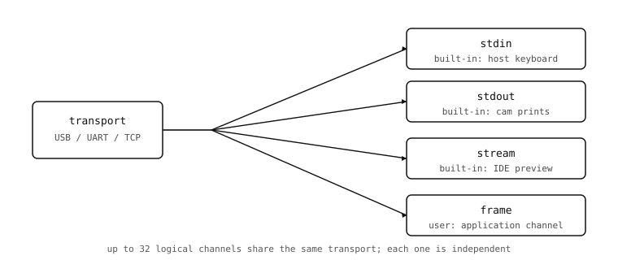

Named channels
==============

The channel ID in each packet's header lets up to 32 independent
streams share the same physical transport. The channel layer turns
those numeric IDs into named, application-visible endpoints that
the host code can refer to by string.

         labelled channels on the cam side -- stdin, stdout,
         stream, and a user-registered frame channel -- each
         showing as an independent box.
   :align: center

The four built-in channels
--------------------------

The cam registers four channels at boot, before any application
code runs:

* ``stdin`` -- bytes the host sends to the cam's MicroPython
  ``input`` and the REPL. When the IDE shows a Python prompt that
  reads keystrokes, it's piping them through ``stdin``.
* ``stdout`` -- bytes from cam ``print()`` calls and uncaught
  exception tracebacks. The IDE's serial console reads this
  channel.
* ``stream`` -- the live preview channel. The IDE pulls JPEG frames
  from it; any host script can do the same with
  :meth:`~openmv.camera.Camera.read_frame`.
* ``profile`` -- profiler events, present only when the cam was
  built with profiling enabled. Most release builds omit it.

Application code shouldn't touch ``stdin`` or ``stdout`` directly
(let MicroPython handle them) and rarely needs to interact with
``profile`` (the profiler tools do). The interesting work happens
on channels the application registers itself.

Registering a channel
---------------------

A cam-side script registers a new channel by calling
:func:`protocol.register` with a name and a Python *backend* object::

   import protocol

   class FrameChannel:
       def size(self):
           return len(latest_jpeg) if latest_jpeg else 0
       def read(self, offset, size):
           return latest_jpeg[offset:offset + size]
       def poll(self):
           return latest_jpeg is not None

   protocol.register(name='frame', backend=FrameChannel())

The backend object's methods decide what the channel can do. A
backend with only ``size`` and ``read`` is a *read-only data
channel*; add ``write`` and it becomes bidirectional; add ``poll``
and the host can ask whether new data is ready before paying for a
read.

A small amount of bookkeeping happens automatically:

* The library assigns the next free channel ID (between 0 and 31).
* The capability flags are derived from the methods present:
  ``CHANNEL_FLAG_READ`` if ``read`` is defined,
  ``CHANNEL_FLAG_WRITE`` if ``write`` is defined,
  ``CHANNEL_FLAG_LOCK`` if ``lock`` / ``unlock`` are defined.
* A ``CHANNEL_REGISTERED`` event packet is sent to any connected
  host so its channel list updates.

The return value is a :class:`protocol.ProtocolChannel` handle the
application can hold on to. The handle's :meth:`send_event` method
is the cam-side hook for telling the host "something happened on
this channel without changing the readable data" -- a frame-grabbed
notification, a button-press event, a sample-count milestone.

Reading channels from the host
------------------------------

On the host side, :class:`openmv.camera.Camera` exposes the same
named channels through high-level methods::

   from openmv.camera import Camera

   with Camera('/dev/ttyACM0') as cam:
       if cam.has_channel('frame'):
           size = cam.channel_size('frame')
           data = cam.channel_read('frame', size)

The string ``'frame'`` is looked up once into the channel ID the cam
assigned during ``register`` and used in every packet from then on.
:meth:`~openmv.camera.Camera.channel_size` and
:meth:`~openmv.camera.Camera.channel_read` are the workhorse
methods; :meth:`~openmv.camera.Camera.channel_write` round-trips a
buffer to the cam if the backend has a ``write`` method;
:meth:`~openmv.camera.Camera.has_channel` is the safe way to check
that a name is registered before using it.

Independence between channels
-----------------------------

Three things are worth knowing about how channels interact:

* **Independent flow control.** Each channel has its own pending
  read state, its own data, and its own ``size`` / ``read`` /
  ``write`` callbacks. A long-running read on the ``stream``
  channel doesn't block reads on the application's ``config``
  channel.
* **Sequential per channel.** Within a single channel, packets are
  delivered in order. The reliability layer guarantees this even
  when retransmits are involved.
* **Shared transport, shared retransmit budget.** All channels
  share the one physical link, so a torrent of traffic on one
  channel slows the others down by hogging the wire. The
  ``CHANNEL_LOCK`` mechanism lets one channel reserve the wire for
  an atomic multi-packet read; the backend opts in by implementing
  the ``lock`` / ``unlock`` callbacks.

A channel is the minimum surface area on which a host program and a
cam program agree to cooperate. The name, the directionality (read
or write or both), the callback methods on the cam side, and the
matching method calls on the host side are the entire contract.
