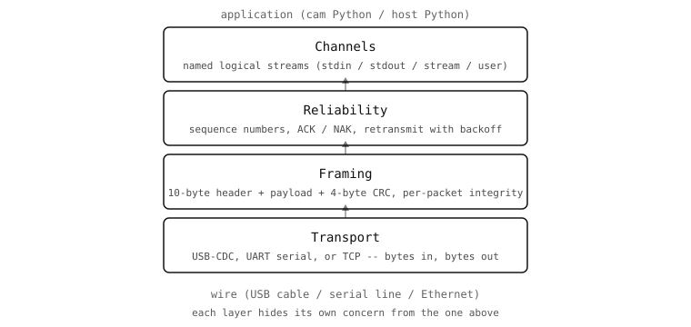

The four layers
===============

The protocol library is built as a stack of four layers, each one
solving a single problem and building on the layer below it. The
rest of the chapter walks the stack from bottom to top.

         bottom (USB or UART or TCP), framing above it (packet
         header with CRC), reliability above that (sequence numbers,
         ACK / NAK, retransmits), and channels at the top (named
         logical streams).
   :align: center

Transport
---------

At the bottom is the byte pipe between the cam and the host. The
protocol library doesn't care which one carries the bytes:

* USB-CDC over the USB port the cam is plugged into. The default and
  highest-bandwidth option for every cam with a USB-C port.
* UART over a pair of GPIO pins on the cam connected to a serial
  adapter on the host. Useful for headless deployments where the
  USB port is busy or isn't physically accessible.
* TCP over Wi-Fi or Ethernet, on cams that have networking. The cam
  acts as a TCP server and the host opens a socket to it.

The transport's only job is "bytes go in, bytes come out, in order".
Everything above this layer assumes that the transport delivers
bytes in the order they were written, but allows for the bytes
themselves to be corrupted or for the link to drop entirely. Lossy
bursts (a few bytes missing) and clean drops (the whole link gone
for a while, then back) are both handled higher up.

Framing
-------

The next layer up imposes structure on the byte stream. Every
message becomes a *packet*: a 10-byte header followed by a payload
followed by a 4-byte trailer. The header carries:

* A 2-byte sync word (``0xD5AA``) that lets a receiver re-find the
  start of a packet after a desync.
* A 1-byte sequence number used by the reliability layer.
* A 1-byte channel ID that says which logical stream the packet
  belongs to.
* A 1-byte flags field for ACK / NAK / fragment / event bits.
* A 1-byte opcode that distinguishes protocol commands, system
  commands, and channel commands.
* A 2-byte payload length.
* A 2-byte CRC over the previous eight header bytes.

The payload follows, then a 4-byte CRC over the payload itself. The
two CRCs catch corruption independently: a flipped bit in the
header invalidates the header CRC, and the receiver can drop the
packet without ever needing to read the payload.

Reliability
-----------

The reliability layer turns "packets that *might* arrive" into
"packets that *have* arrived." It tracks the sequence numbers in
the header, asks the other side to send acknowledgements for every
packet that requires one, and retransmits when an acknowledgement
doesn't arrive within a timeout. By default the retransmit timeout
starts at 500 ms and doubles on each retry, with three retries
before giving up.

Each of those behaviours is configurable in the :func:`protocol.init`
call: ACK can be turned off for one-way streams, CRC validation
can be skipped on perfectly clean transports, and the retransmit
parameters can be tuned for slow or high-latency links.

Channels
--------

The top layer is what application code sees. A *channel* is a named
logical stream identified by a channel ID from 0 to 31. Up to 32
channels can coexist on one transport; each one is independent of
the others, addressed by its ID in every packet's header.

Four channels are built in:

* ``stdin`` -- bytes typed in the host's REPL forwarded to the cam.
* ``stdout`` -- ``print`` output from the cam forwarded to the
  host.
* ``stream`` -- the default channel the IDE uses to pull live
  frames.
* ``profile`` -- profiler events, when the cam is built with
  profiling.

Application code adds more by calling :func:`protocol.register` on
the cam side, which exposes a Python class as a new named channel.
The host then sees it in the channel list, can ``channel_read`` from
it, ``channel_write`` to it, and react to events from it.

The four layers don't mix concerns. Framing doesn't know about
channels; reliability doesn't know about packet contents; the
channel layer doesn't know how the bytes arrive. That separation is
why a transport swap (USB to UART, for example) doesn't ripple up
into the channel code.

The rest of this chapter walks the same stack: framing on the next
pages, reliability after that, channels above, and finally Python
code on both ends.
