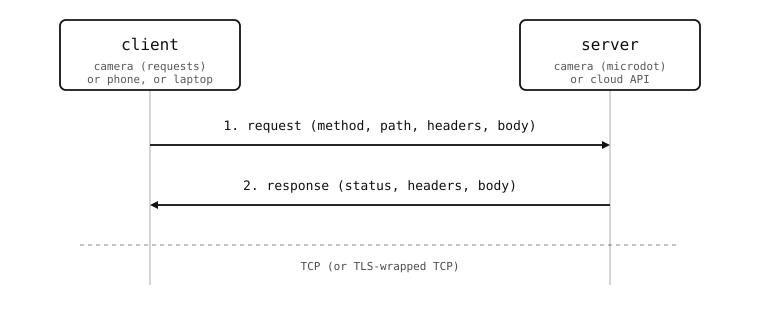

Client and server roles
=======================

An HTTP conversation has exactly two roles, and every device on the
network is doing one of them at any moment. The distinction is
mechanical but useful, because the camera-side library you reach for
depends on which side the camera is playing.

The two roles
-------------

* The **client** *initiates*. It picks the target server, opens a
  TCP connection (or a TLS-wrapped one), writes a request, reads the
  response, and closes -- or keeps the socket open for the next
  request on the same connection. The client knows the URL it wants
  to hit. On the camera, the :mod:`requests` module plays this role.

* The **server** *listens*. It binds to a port, accepts incoming
  connections, reads each request, dispatches to a handler keyed on
  the URL and HTTP method, writes the response, and goes back to
  waiting. The server does not know who is going to connect or
  what they will ask for. On the camera, the :mod:`microdot`
  framework plays this role.

A single device can play both roles at once -- the camera might
serve a control panel to a phone *and* upload its captures to a
cloud API in the same script. The two ends of one connection,
though, are fixed: one side speaks first (the client), the other
side waits to be spoken to (the server).

         with a small "camera (or phone, or laptop)" annotation
         below; the right is labelled "server" with "camera
         (microdot) or cloud API" below. A solid arrow points
         right labelled "1. request (method, path, headers,
         body)". A solid arrow points left labelled "2. response
         (status, headers, body)". A small dashed annotation below
         reads "TCP (or TLS-wrapped TCP)".

   One HTTP exchange. The client picks the URL, sends the request,
   reads the response, and decides what to do next. The server
   just answers.

Method, path, body
------------------

Every HTTP request carries four pieces of information that the
camera sees on both sides:

* **Method** -- ``GET``, ``POST``, ``PUT``, ``PATCH``, ``DELETE``,
  ``HEAD``, ``OPTIONS``. ``GET`` retrieves something without side
  effects; ``POST`` creates something new; ``PUT`` and ``PATCH``
  update; ``DELETE`` removes. The method is a hint, not a rule --
  the application enforces what each method actually does.
* **Path** -- the URL portion after the host. The server picks
  routes by path: ``/api/status``, ``/snapshot.jpg``,
  ``/users/42``.
* **Headers** -- a flat dict of metadata. Common entries: ``Host``
  (the target hostname), ``Content-Type`` (what kind of body),
  ``Authorization`` (who is asking), ``User-Agent`` (which client
  software). The body is everything after a blank line.
* **Body** -- optional. ``GET`` requests rarely have one; ``POST``
  / ``PUT`` typically carry JSON or a form payload.

The response mirrors this:

* **Status code** -- 200 means success, 3xx is a redirect, 4xx is
  "the client did something wrong" (401 unauthorized, 404 not
  found, ...), 5xx is "the server did something wrong" (500
  internal error). The client decides what to do on each.
* **Headers** -- ``Content-Type`` of the body, ``Set-Cookie`` for
  session cookies, ``Content-Length``, and so on.
* **Body** -- the answer. JSON, HTML, an image, a downloaded file,
  whatever the request asked for.

Naming and addressing
---------------------

A URL like ``http://kitchen-cam.local/api/status`` decomposes as:

* ``http`` is the *scheme* -- plain HTTP on TCP port 80, or
  ``https`` for the TLS-wrapped version on port 443. Both ports
  can be overridden with ``:<port>`` after the host.
* ``kitchen-cam.local`` is the *host* -- resolved via DNS (or
  mDNS for ``.local`` names, see
  :doc:`/openmvcam/tutorial/networking/names/dns`) into the IP
  address of the server.
* ``/api/status`` is the *path* -- what the server uses to route
  the request to a handler.

The client supplies the full URL; the server only ever sees the
path (the host header tells it which virtual host was asked for,
but on a single-purpose camera that is rarely interesting).

Stateless by default
--------------------

HTTP is *stateless* -- two requests from the same client land at
the server with no built-in indication that they are related. The
server cannot assume that "the same socket" means "the same user";
in fact the same socket is often reused by other clients via a
proxy. State that should survive requests has to be carried
explicitly: cookies, ``Authorization`` headers, query-string
tokens. The :mod:`microdot.session` module sets up signed cookies
for this; :doc:`auth-and-sessions <../server/auth-and-sessions>`
covers the patterns.

The pages ahead start with the client side -- it is the simpler of
the two, since the client only ever has to issue one request and
read one answer -- and then turn to the server, which has to wait
for whatever the world sends it.
