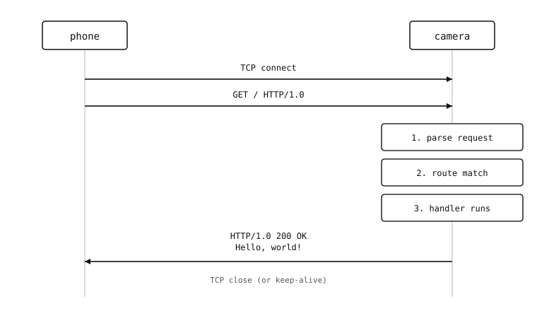

A minimal microdot app
======================

The camera's HTTP server is the :mod:`microdot` framework -- small,
Flask-inspired, built on :mod:`asyncio`. The smallest useful program
is five lines of Python and one ``import``::

    from microdot import Microdot

    app = Microdot()

    @app.route('/')
    async def index(request):
        return 'Hello, world!'

    app.run(host='0.0.0.0', port=80)

What each line is doing
-----------------------

* ``from microdot import Microdot`` -- the framework's main class.
* ``app = Microdot()`` -- one application instance per script.
  Decorators on this instance register handlers.
* ``@app.route('/')`` -- maps the URL path ``/`` to the handler
  function. ``GET`` is the default method; :doc:`routing` covers
  ``POST``, ``PUT``, dynamic segments, etc.
* ``async def index(request)`` -- every handler is an
  :mod:`asyncio` coroutine that takes the request object as its
  first argument. Returning a string sends a ``text/plain`` 200
  response; :doc:`handlers` covers JSON, files, redirects, custom
  status codes.
* ``app.run(host='0.0.0.0', port=80)`` -- bind the server to all
  interfaces on port 80 (the standard HTTP port) and serve forever.
  ``app.run`` blocks the caller and wraps :func:`asyncio.run`.

How the server handles a request
--------------------------------

When the camera receives an HTTP request:

#. MicroPython accepts the TCP connection and hands it to the
   :mod:`asyncio` event loop.
#. Microdot reads the request line, headers, and body from the
   socket into a :class:`~microdot.Request` object.
#. The framework matches the request's path against the registered
   routes and calls the first handler whose pattern matches and
   whose method list includes the request's method.
#. The handler returns a value -- a string, a dict, a
   :class:`~microdot.Response`, or a tuple.
#. Microdot converts that value into an HTTP response and writes
   it back to the client.
#. The connection closes (or stays open for HTTP keep-alive).

         a phone (left) and the camera (right). The phone sends
         "TCP connect" and "GET / HTTP/1.0" arrows to the camera;
         the camera passes the request through three boxes labelled
         "parse request", "route match", and "handler runs"; then
         sends "HTTP/1.0 200 OK\\n\\nHello, world!" back. The
         connection closes.

   One request through Microdot. Parsing, routing, and the
   application handler all run on the asyncio event loop -- multiple
   requests interleave on the same thread.

Concurrent clients on one thread
--------------------------------

Microdot runs on :mod:`asyncio`. There are no threads -- a single
event loop juggles every active request by cooperatively switching
between coroutines on each ``await``. Two consequences for handler
code:

* **Anything that waits on I/O should be awaitable.** Use
  :mod:`asyncio`-friendly libraries (:mod:`aioble`, raw socket
  primitives with ``setblocking(False)``, etc.). A handler that
  calls a blocking function freezes the whole server for the
  duration of that call -- other connected clients stall too.
* **Shared mutable state uses asyncio primitives.** Use
  :class:`asyncio.Lock` / :class:`asyncio.Event` if two handlers
  could race against each other on the same data. For most camera
  use cases the request handlers share read-only state (a
  configuration dict, the camera frame buffer) and need no
  synchronization at all.

The asyncio chapter (:doc:`/openmvcam/tutorial/asyncio/index`)
covers the model in depth; this section assumes that material.

Running alongside the imaging loop
----------------------------------

The five-line example above blocks the script forever in
``app.run``. A real camera application also needs to capture
frames, run inference, drive an output. The pattern is to schedule
the server as one :mod:`asyncio` task alongside the imaging task.
The example below uses the ``AsyncCSI`` wrapper from
:doc:`/openmvcam/tutorial/asyncio/capstone/snapshot-loop` so the
capture coroutine yields cleanly between frames, and serves the
captured frames as an **MJPEG video stream** at
``http://<cam>/stream.jpg``::

    import asyncio
    import csi
    from microdot import Microdot, Response

    class AsyncCSI:
        def __init__(self, *args, **kwargs):
            self._csi = csi.CSI(*args, **kwargs)

        def __getattr__(self, name):
            return getattr(self._csi, name)

        async def snapshot(self):
            while True:
                img = self._csi.snapshot(blocking=False)
                if img is not None:
                    return img
                await asyncio.sleep_ms(0)

    csi0 = AsyncCSI()
    csi0.reset()
    csi0.pixformat(csi.RGB565)
    csi0.framesize(csi.QVGA)

    latest_jpeg = None

    async def capture_loop():
        global latest_jpeg
        while True:
            img = await csi0.snapshot()
            latest_jpeg = bytes(img.compress(quality=85).bytearray())

    app = Microdot()
    BOUNDARY = b'frame'

    class MjpegFrames:
        # MicroPython's asyncio has no async-generator functions, so the
        # streaming body is a class with __aiter__ / __anext__.

        def __aiter__(self):
            return self

        async def __anext__(self):
            while latest_jpeg is None:
                await asyncio.sleep_ms(20)
            return (b'--' + BOUNDARY + b'\r\n'
                    b'Content-Type: image/jpeg\r\n\r\n'
                    + latest_jpeg + b'\r\n')

    @app.get('/stream.jpg')
    async def stream(request):
        return Response(
            body=MjpegFrames(),
            headers={
                'Content-Type':
                    b'multipart/x-mixed-replace; boundary=' + BOUNDARY,
            },
        )

    async def main():
        await asyncio.gather(
            capture_loop(),
            app.start_server(host='0.0.0.0', port=80),
        )

    asyncio.run(main())

:meth:`~microdot.Microdot.start_server` is the coroutine form of
:meth:`~microdot.Microdot.run`. Use it whenever the server should
share the event loop with other tasks. ``asyncio.gather`` runs
both coroutines concurrently; either dropping out cancels the
other. ``AsyncCSI.snapshot`` uses non-blocking
:meth:`csi.CSI.snapshot` under the hood, so the capture task
yields back to the event loop between frames -- letting the HTTP
handler write each MJPEG chunk to the connected browser while
the sensor is preparing the next frame.

The full MJPEG stream pattern -- multi-client fan-out, sharing
the same capture loop across an arbitrary number of viewers,
JPEG quality knobs -- is covered on
:doc:`serving-frames`.

The rest of this section unpacks each piece -- routing, request
parsing, response construction, frame streaming, push channels,
auth, and the operational layer of HTTPS / CORS / CSRF.
