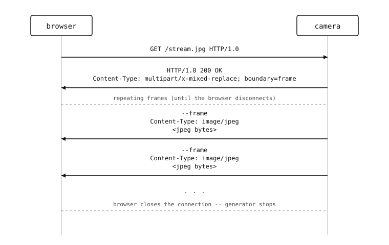

Serving frames
==============

The canonical camera-side HTTP endpoint is the live preview -- a
phone or laptop browses to ``http://<cam>/`` and sees the camera's
sensor in close to real time. Two patterns cover almost every
case: a single still image returned by a ``GET`` request, and a
continuous **MJPEG** stream that updates as fast as the sensor and
the network allow.

A single snapshot
-----------------

The simplest "show me what the camera sees" endpoint takes a
fresh frame on every request, JPEG-compresses it, and returns the
bytes::

    from microdot import Microdot, Response
    import csi

    csi0 = csi.CSI()
    csi0.reset()
    csi0.pixformat(csi.RGB565)
    csi0.framesize(csi.QVGA)

    app = Microdot()

    @app.get('/snapshot.jpg')
    async def snapshot(request):
        img = csi0.snapshot().compress(quality=85)
        return Response(
            body=img.bytearray(),
            headers={'Content-Type': 'image/jpeg'},
        )

    app.run(host='0.0.0.0', port=80)

A few things worth knowing:

* :meth:`~csi.CSI.snapshot` is blocking. Inside an asyncio handler
  this stalls the whole event loop for the duration of the
  exposure -- a fraction of a second at QVGA, longer at higher
  resolutions. For higher-rate snapshot endpoints, pair the
  capture with a background task that keeps the latest frame
  cached (see the next section).
* The byte buffer returned by :meth:`~image.Image.bytearray` is
  owned by the :class:`~image.Image` -- it stays valid until the
  next ``snapshot()`` call. Microdot writes it before returning,
  so this is safe in a single-handler request.
* The browser caches static-looking URLs aggressively. Append a
  cache-buster (``/snapshot.jpg?t=1717180000``) or set
  ``Cache-Control: no-store`` on the response if the same URL
  should always return a fresh frame.

The MJPEG live stream
---------------------

A continuous live preview uses ``multipart/x-mixed-replace`` --
the server keeps the connection open and writes one JPEG per
frame separated by a multipart boundary; the browser displays
each frame in turn until the connection drops.


         HTTP/1.0" to the camera. The camera replies with "HTTP/1.0
         200 OK\\nContent-Type: multipart/x-mixed-replace;
         boundary=frame", then sends repeating blocks of
         "--frame\\nContent-Type: image/jpeg\\n\\n<jpeg bytes>"
         until the browser closes the connection.

   The MJPEG over HTTP wire format. One connection, one HTTP
   response that never finishes, a stream of JPEG frames
   separated by a multipart boundary.

The microdot implementation streams an **async iterator** as the
response body. The handler returns an instance of a class with
``__aiter__`` / ``__anext__``; microdot calls ``__anext__``
repeatedly and writes each returned chunk to the socket until the
client disconnects.

.. note::

   MicroPython's :mod:`asyncio` does not support async-generator
   *functions* (``async def name(): ... yield ...``). Streaming
   response bodies must be **class-based** async iterators, with
   ``__aiter__`` returning ``self`` and ``__anext__`` defined as
   ``async def``.

::

    from microdot import Microdot, Response
    import asyncio
    import csi

    csi0 = csi.CSI()
    csi0.reset()
    csi0.pixformat(csi.RGB565)
    csi0.framesize(csi.QVGA)

    app = Microdot()

    BOUNDARY = b'frame'


    class FrameStream:
        def __aiter__(self):
            return self

        async def __anext__(self):
            img = csi0.snapshot().compress(quality=85)
            await asyncio.sleep_ms(0)
            return (b'--' + BOUNDARY + b'\r\n'
                    b'Content-Type: image/jpeg\r\n\r\n'
                    + bytes(img.bytearray()) + b'\r\n')


    @app.get('/stream.jpg')
    async def stream(request):
        return Response(
            body=FrameStream(),
            headers={
                'Content-Type': b'multipart/x-mixed-replace; boundary='
                                 + BOUNDARY,
            },
        )

    app.run(host='0.0.0.0', port=80)

Pointing a browser at ``http://<cam>/stream.jpg`` gets the live
preview. Embedding the same URL in an ```` element on a
control-panel HTML page works the same way -- the browser treats
the ```` source as a stream automatically.

The ``await asyncio.sleep_ms(0)`` after the capture yields to the
event loop once per frame, so other handlers get scheduling
slots between captures. Without it the streaming task
monopolizes the loop and other requests stall.

Sharing one capture loop with multiple clients
----------------------------------------------

Calling :meth:`~csi.CSI.snapshot` once per connected client wastes
sensor work -- four browsers staring at the stream means four
captures per cycle. The common pattern is one capture task that
publishes to a shared "latest frame" slot, and per-client
streamers that read from the slot. The capture task uses the
``AsyncCSI`` wrapper from
:doc:`/openmvcam/tutorial/asyncio/capstone/snapshot-loop` so the
sensor work overlaps cleanly with the per-client write loops::

    import asyncio
    import csi
    from microdot import Microdot, Response


    class AsyncCSI:
        def __init__(self, *args, **kwargs):
            self._csi = csi.CSI(*args, **kwargs)

        def __getattr__(self, name):
            return getattr(self._csi, name)

        async def snapshot(self):
            while True:
                img = self._csi.snapshot(blocking=False)
                if img is not None:
                    return img
                await asyncio.sleep_ms(0)


    csi0 = AsyncCSI()
    csi0.reset()
    csi0.pixformat(csi.RGB565)
    csi0.framesize(csi.QVGA)

    latest_jpeg = None
    new_frame = asyncio.Event()

    async def capture_loop():
        global latest_jpeg
        while True:
            img = await csi0.snapshot()
            latest_jpeg = bytes(
                img.compress(quality=85).bytearray()
            )
            new_frame.set()

    app = Microdot()
    BOUNDARY = b'frame'


    class ClientStream:
        # Each connected client gets its own instance, so the per-client
        # event clear() does not steal frames from siblings.

        def __aiter__(self):
            return self

        async def __anext__(self):
            await new_frame.wait()
            new_frame.clear()
            jpeg = latest_jpeg
            if jpeg is None:
                return b''
            return (b'--' + BOUNDARY + b'\r\n'
                    b'Content-Type: image/jpeg\r\n\r\n'
                    + jpeg + b'\r\n')


    @app.get('/stream.jpg')
    async def stream(request):
        return Response(
            body=ClientStream(),
            headers={
                'Content-Type': b'multipart/x-mixed-replace; boundary='
                                 + BOUNDARY,
            },
        )

    @app.get('/snapshot.jpg')
    async def snapshot(request):
        if latest_jpeg is None:
            return 'no frame yet', 503
        return Response(
            body=latest_jpeg,
            headers={'Content-Type': 'image/jpeg'},
        )

    async def main():
        await asyncio.gather(
            capture_loop(),
            app.start_server(host='0.0.0.0', port=80),
        )

    asyncio.run(main())

Now ``snapshot.jpg`` and any number of ``stream.jpg`` clients
share the same captured frames. The sensor runs at its own pace;
slow clients see fewer frames but the fast ones do not. The
``await csi0.snapshot()`` call inside ``capture_loop`` yields back
to the event loop on every poll, so the per-client write
generators get scheduling slots between captures instead of being
starved by a blocking sensor read.

Receiving an uploaded image
---------------------------

The other direction -- a client uploads a still image to the
camera -- uses ``multipart/form-data`` and the
:func:`microdot.multipart.with_form_data` decorator::

    from microdot import Microdot
    from microdot.multipart import with_form_data

    app = Microdot()

    @app.post('/upload')
    @with_form_data
    async def upload(request):
        for name, file in request.files.items():
            await file.save('/sdcard/' + sanitize(file.filename))
        return {'ok': True, 'count': len(request.files)}

The decorator parses the multipart body and populates
:attr:`request.files <microdot.Request.files>`. Each entry is a
:class:`~microdot.multipart.FileUpload` -- :meth:`~FileUpload.read`
to get the bytes, :meth:`~FileUpload.save` to write to a path. For
uploads larger than a couple of megabytes, use
:class:`~microdot.multipart.FormDataIter` directly to stream the
parts without buffering the whole body first.

Always sanitize the filename before opening it -- ``..``
sequences and absolute paths from a malicious client otherwise
let them write anywhere on the filesystem.

The next page covers the other realtime channel: push streams
(server-sent events) and bidirectional channels (WebSockets) for
data that isn't a stream of images.
